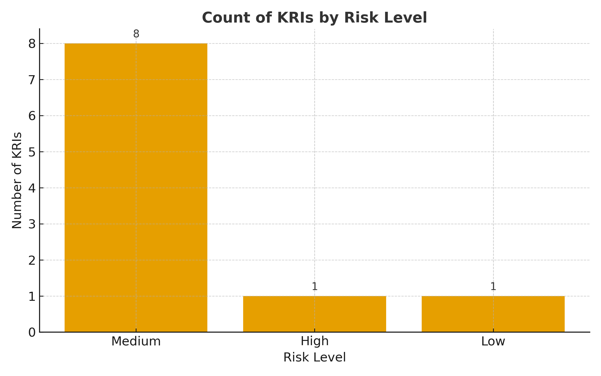

# grc-kri-dashboard
Sample Key Risk Indicator dashboard for cybersecurity governance and visibility.
#
#
# GRC KRI Dashboard 📊

### Purpose
This project demonstrates how Key Risk Indicators (KRIs) can be used to visualize and manage cybersecurity risk in a measurable, business-aligned way.

---

### Example KRIs
| Category | Metric | Description | Frequency |
|-----------|---------|-------------|------------|
| Network | DNS Traffic to Foreign IPs | Detects potential data exfiltration or C2 activity | Daily |
| Infrastructure | NTP Anomalies | Identifies abnormal time-sync traffic | Daily |
| Governance | Firewall Exception Aging | Highlights long-lived exceptions for review | Weekly |
| Awareness | Phishing Simulation Fail Rate | Measures human risk and program effectiveness | Monthly |

---

### Features
✅ Simple CSV-based dataset of sample KRIs  
✅ Risk scoring and trend visualization concepts  
✅ Clear mapping of metrics to governance categories (Identify, Protect, Detect, Respond, Recover)  
✅ Easily expandable for Splunk, Power BI, or Excel dashboards  

---

### Future Enhancements
- Integrate with Splunk or Power BI for automated visuals  
- Add NIST CSF mapping for each KRI  
- Include trendline visualizations for quarterly reporting  

---

### Author
**Andra Jones, CISSP, CISA**  
Senior Cybersecurity & GRC Professional  
Focused on bridging metrics, governance, and real-world risk insights.  
